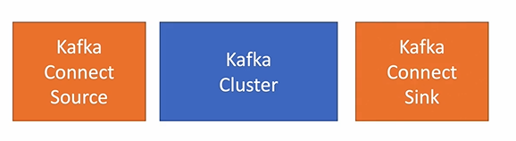

### 주키퍼 및 카프카 서버 구동
- ``$KAFAKA_HOME/bin/zookeeper-server-start.bat $KAFKA_HOME/config/zookeeper.properties``
- ``$KAFAKA_HOME/bin/kafka-server-start.bat $KAFKA_HOME/config/server.properties``

### Topic 생성
- ``$KAFAKA_HOME/bin/kafka-topics.bat --create --topic quickstart-events --bootstrap-server loclhost:9092 --partitions 1``
  - 토빅에 전달된 메세지를 토픽에 관심있는 컨슈머에 전달해준다. 그래서 보내는 사람과 받는 사람을 알필요 없다.
  - 부트스트랩 서버라는 것은 단일서버이기 때문에 9092카프카 서버에 토픽을 생성하겠다고 하는 것
  - 파티션은 멀티클러스터링인 경우 토픽에 전달되어 있는 메세지를 몇군데에 나누어 저장할것인지 정하는 옵션

### Topic 목록 확인
- ``$KAFAKA_HOME/bin/zookeeper-server-start.bat $KAFKA_HOME/bin/kafka-topics.bat --bootstrap-server localhost:9092 --list``
- 토픽의 상세 정보를 원할 경우
  - ``$KAFAKA_HOME/bin/zookeeper-server-start.bat $KAFKA_HOME/bin/kafka-topics.bat --describe --topic quickstart-events --bootstrap-server localhost:9092``

### producer와 consumer
- ``$KAFAKA_HOME/bin/kafka-console-producer.bat --broker-list localhost:9092 --topic quickstart-events``
- ``$KAFAKA_HOME/bin/kafka-console-consumer.bat --bootstrap-server localhost:9092 --topic quickstart-events --from-beginning``

### kafka connect
- 데이터를 특정한 곳에서 받아와 다른 곳으로 이동시켜줄 수 있다.
- 코드 없이 configuration으로 데이터를 이동 가능하다
- standalone mode, distribution mode를 지원한다.
  - restful API를 통해 지원한다
  - stream 또는 batch 형태로 데이터를 전송할 수 있다.
  - 커스텀 connector를 통해 다양한 plugin을 제공한다.

- 기존에 데이터를 커넥트 소스로 가져와 카프카 클러스터에 저장
- sink를 통해 저장한 데이터를 export할 수 있다. db복제시에도 connect로 작업할 수 있다.
- 설치 방법
  - ``curl -O http://packages.confluent.io/archive/6.1/confluent-community-6.1.0-bin.tar.gz``
  - ``tar xvf confluent-community-6.1.0-bin.tar.gz``
  - ``cd [kafka connect 압축해제 폴더]``
  - kafka connect 실행 ``.\bin\windows\connect-distributed.bat .\etc\kafka\connect-distributed.properties``
  - 
- 관계형 DB를 사용하려면 JDBC connect를 설치해야함
  - ``https://docs.confluent.io/5.5.1/connect/kafka-connect-jdbc/index.html``
  - 다운로드한 zip을 사용
  - ``etc/kafka/connect-distributed.properties``파일 마지막 아래에 사용할 플로그인 정보 추가
  - ``plugin.path=[jdbc connect 폴더 경로]``
  - jdbcSourceConnector에서 mariaDB를 사용하기 위해 mariaDB 드라이버 복사
    - ./share/java/kafka/폴더에 mariadb-java-client-2.7.2.jar 파일 복사
###