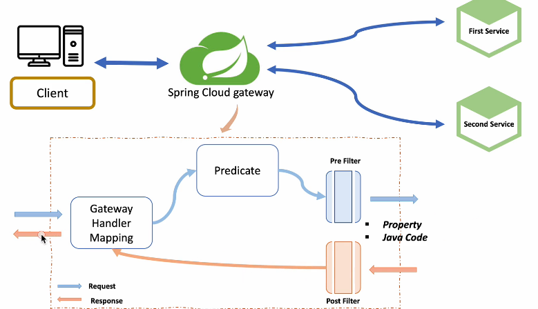

## 역할
사용자가 설정한 라우팅 설정에 다라 각각 엔드 포인트로 클라이언트 대신 요청하고 받으면 다시 클라이언트에 전달하는 프록시 역할을 한다.
시스템의 내부 구조는 숨기고 외부의 요청에 대해서 적절한 형태로 가공해서 응답할 수 있다는 장점을 가지고 있다.

## 필요성
클라이언트 사이드에서 엔드포인트를 직접 호출하면 변경할 때마다 계속 프론트에서도 변경할 필요가 있다.
그래서 진입로(게이트웨이)를 두고 모든 정보를 처리할 수 있게한다.

## 기능
- 인증 및 권한 부여
- 서비스 검색 통합
- 응답 캐싱
- 정책, 회로 차단기 및 QoS 다시 시도
- 속도 제한
- 부하 분산
- 로깅, 추적, 상관 관계
- 헤더, 쿼리 문자열 및 청구 변환
- IP 허용 목록에 추가

## Netflix Ribbon
- Spring cloud에서의 MSA간 통신
  1. RestTemplate
  2. Fegin Client
- Ribbon: 클라이언트 사이드 로드 밸런서
  - 서비스 이름으로 호출
  - Health Check

## Netflix Zuul
- 구성
  - First Service
  - Second Service
  - Netflix Zuul\
클라이언트가 줄에 요청하면 줄이 요청을 서비스로 보내는 역할을 한다.
줄이 라우팅, api 게이트웨이 역할을 한다.

## Spring Cloud Gateway - Filter
먼저 게이트웨이가 클라이언트에서 어떤 요청이 왔는지 요청 정보를 받고
그 요청에 대해 사전조건, 어떤 이름으로 요청되었는지 Predicate에서 조건을 분기해준다.
Pre Filter와 Post Filter를 작성해서 요청 정보를 구성할 수 있다.
예제에서는 자바코드에 처리하는 방법과 yaml파일로 처리하는 방법으로 다룰 것이다.

