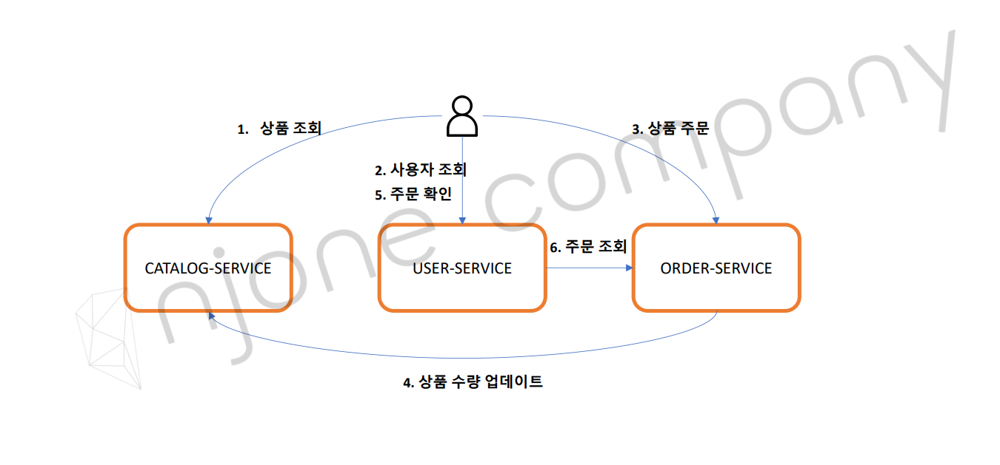
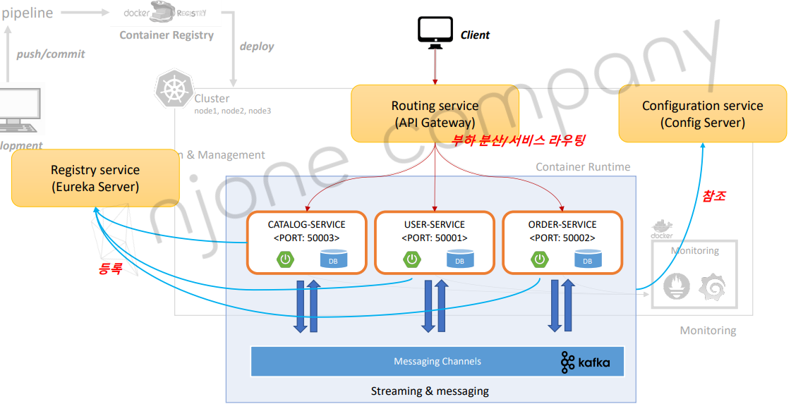

# 애플리케이션 개요

## CATALOG-SERVICE
사용자는 CATALOG-SERVICE에서 조회 정보로 상품을 조회할 수 있다.

## USER-SERVICE
USER-SERVICE는 유저에 대한 정보만 가지고 있어야한다.
사용자가 주문을 확인할 상황이 생긴다면 ORDER-SERVICE에 주문이 있는지 확인하고 가져온다.(마이크로 서비스 간 통신)
아니면 사용자가 ORDER-SERVICE에 직접 물어볼 수 있다.

## ORDER-SERVICE
주문했을 때 재고가 감소해야할 것이다. CATALOG-SERVICE에서 가격과 재고를 표시할 것인데 감소된 정보를 업데이트 해야한다.
이 때, Kafka(MQ)로 ORDER-SERVICE가 정보를 produce하면 subscribe한 CATALOG-SERVICE가 정보를 받아 업데이트한다.

## 구성 요소
- Git Repository
  - 마이크로서비스 소스 관리 및 프로파일 관ㄹ;
- Config Server
  - Git 저장소에 등록된 프로파일 정보 및 설정 정보
- Eureka Server
  - 마이크로서비스 등록 및 검색
- API Gateway Server
  - 마이크로서비스 부하 분산 및 서비스 라우팅
- Microservices
  - 회원 MS, 주문 MS, 상품(카테고리)MS
- Queuing System
  - 마이크로서비스 간 메시지 발행 및 구독

## APIs
- Catalog Service
  - /catalog-service/catalog (GET) : 상품 목록 제공
- User Service
  - /user-service/users (POST) : 사용자 정보 등록
  - /user-service/users (GET) : 전체 사용자 조회
  - /user-service/users/{user_id} (GET) : 사용자 정보, 주문 내역 조회
- Order Service
  - /order-service/users/{user_id}/orders (POST) : 주문 등록
  - /order-service/users/{user_id}/orders (GET) : 주문 확인