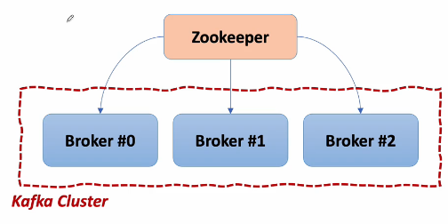

## 데이터 동기화 문제
- ORDER-SERVIC를 2개 이상 사용할 때
  - 각각 포트는 분리되어 있다.
  - 각 포트에 따라 DB도 분리되어 사용한다.
- 사용자 하나에 대해 주문을 여러 개 한다면
  - 각 ORDER-SERVICE에 나누어서 저장하게 된다.
  - 기본적으로 라운드로빈 방식으로 저장.
- 이때, 사용자 상세 정보를 불러오면 RR방식으로 다른 ORDER-SERVICE의 DB에 데이터를 불러온다.
1. 하나의 DB 사용
2. 각각의 DB 사용하고 매게체(MQ) 사용
    - 다른 DB에 저장된 것을 알려줌
3. 혼합 사용.
   - MQ Server가 데이터를 모으고 하나의 DB에 작업을 수행

## Apache Kafka
- 모든 시스템으로 데이터를 실시간으로 전송하여 처리할 수 있는 시스템
  - 데이터가 많아지더라고 확장이 용이한 시스템
- 중간에 도입하여 DB, app, storage 등 자신들이 전송하는 데이터가 어떤 시스템에 저장되는지 관여하지 않고 kafka에 저장하고,
kafka로부터 하둡, 검색엔진, 모니터링 등 데이터를 받을 수 있다.
- Producer/Consumer로 분리하여 메세지를 여러 Consumer에게 허용한다.
- 높은 처리량에 최적화
- 클러스터링 구조로 scale-out 가능
- eco-system으로 데이터를 스트리밍이나 sql문법이 사용가능

### Kafa Broker
- 실행 된 Kafka 애플리케이션 서버
- 기본적으로 3대 이상으로 Kafka Cluster 구성 권장
- Zookeeper 연동
  - 역할: 메타데이터(Broker Id, Contoleer Id 등) 저장
  - Controller 정보 저장
- n개 Broker 중 1대는 Controller 기능 수행
  - Controller 역할
    - 각 Broker에게 담당 파티션 할당 수행
    - Broker 정상 동작 모니터링 관리

### Kafaka Client
- kafka와 데이터를 주고받기 위해 사용하는 java 라이브러리
- producer, consumer, admin, stream등 kafka 관련 api를 제공한다
- C2C가 아닌 중간에 카프카 클러스터가 중계